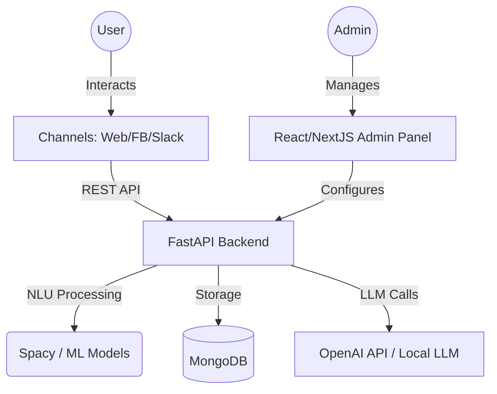

<p align="center">
  
</p>

<p align="center">
  <b>The open-source, self-hosted, DIY Chatbot building platform built in Python.</b>
</p>

<p align="center">
  <a href="https://github.com/abhinavv27/ai-chatbot-usable/actions"></a>
  <a href="https://github.com/abhinavv27/ai-chatbot-usable/actions"></a>
  <a href="License.txt"></a>
</p>

---

## 🚀 Overview

AI Chatbot Framework is a comprehensive platform designed to empower developers and businesses to create, train, and deploy sophisticated AI chatbots with minimal coding effort. 

Unlike black-box commercial solutions, this framework is **fully self-hosted**, giving you 100% ownership of your data and conversational logic. Whether you're building a simple FAQ bot or a complex multi-turn conversational agent, this tool provides the building blocks you need.

## 📸 Preview

### Admin Dashboard & Chat


### Intent & Entity Training
<p align="center">
  
  
</p>

### Bot Testing


## ✨ Key Features

- 🏠 **100% Self-Hosted**: Run it on your own servers or cloud infrastructure.
- 🛠️ **Low-Code Admin Dashboard**: Intuitive UI for building conversational scenarios and training the bot.
- 🧠 **Advanced NLU**: Powered by Spacy and custom ML models for Intent Recognition and Entity Extraction.
- 💬 **Multi-turn Conversations**: Maintain context and handle complex, multi-step user inquiries.
- 🔌 **Tool Calling (API Fulfillment)**: Connect your bot to external APIs to fetch real-time data or trigger actions.
- 💾 **Context Management**: Persistent memory ensures the bot "remembers" user interactions.
- 🌐 **Channel Ready**: Seamlessly integrate with Web (Chat Widgets), Facebook Messenger, and more.
- 🤖 **LLM Integration**: Support for Zero-shot NLU using Large Language Models (LLMs) like OpenAI.

## 🏗️ Architecture

The framework is built with a decoupled architecture to ensure scalability and ease of integration.



## 🛠️ Tech Stack

- **Backend**: Python 3.10+, FastAPI, Pydantic, Motor (Async MongoDB).
- **Frontend**: React, Next.js, Tailwind CSS, TypeScript.
- **Machine Learning**: 
  - **NLU**: Spacy, python-crfsuite.
  - **ML**: Scikit-learn, TensorFlow/Keras.
  - **Orchestration**: LangChain.
- **Database**: MongoDB.
- **Infrastructure**: Docker, Docker Compose, Kubernetes (Helm).

## 🚦 Getting Started

### Prerequisites

- [Docker](https://docs.docker.com/get-docker/) & [Docker Compose](https://docs.docker.com/compose/install/) (v2.14+)
- Python 3.10+ (if running natively)
- Node.js 18+ (if running frontend natively)

### Quick Start (Recommended)

The fastest way to get the framework running is using Docker Compose.

1. **Clone the repository:**
   ```bash
   git clone https://github.com/abhinavv27/ai-chatbot-usable.git
   cd ai-chatbot-usable
   ```

2. **Start the services:**
   ```bash
   docker-compose up -d
   ```

3. **Access the platform:**
   - **Admin Dashboard**: [http://localhost:8080](http://localhost:8080)
   - **Backend API Docs**: [http://localhost:8000/docs](http://localhost:8000/docs)

### Manual Setup (Development)

#### Backend Setup
```bash
cd app
pip install -r ../requirements.txt
# Configure .env variables
python main.py
```

#### Frontend Setup
```bash
cd frontend
npm install
npm run dev
```

## 📖 Documentation

Dive deeper into the features and configuration:

- 📥 [Installation Guide](docs/01-installation.md)
- 🏁 [Getting Started](docs/02-getting-started.md)
- 📝 [Creating your first Bot](docs/03-creating-order-status-check.md)
- 🔗 [Channel Integrations](docs/04-integrating-with-channels.md)
- 🏗️ [Full Architecture](docs/05-architecture.md)

## 🤝 Contributing

We welcome contributions from the community! Whether it's fixing bugs, adding features, or improving documentation.

1. Fork the repo.
2. Create your feature branch (`git checkout -b feature/AmazingFeature`).
3. Commit your changes (`git commit -m 'Add some AmazingFeature'`).
4. Push to the branch (`git push origin feature/AmazingFeature`).
5. Open a Pull Request.

Check our [Contributing Guidelines](CONTRIBUTING.md) for more details.

## 📄 License

This project is licensed under the MIT License - see the [License.txt](License.txt) file for details.

---

<p align="center">
  Built with ❤️ for the open-source community.
</p>
