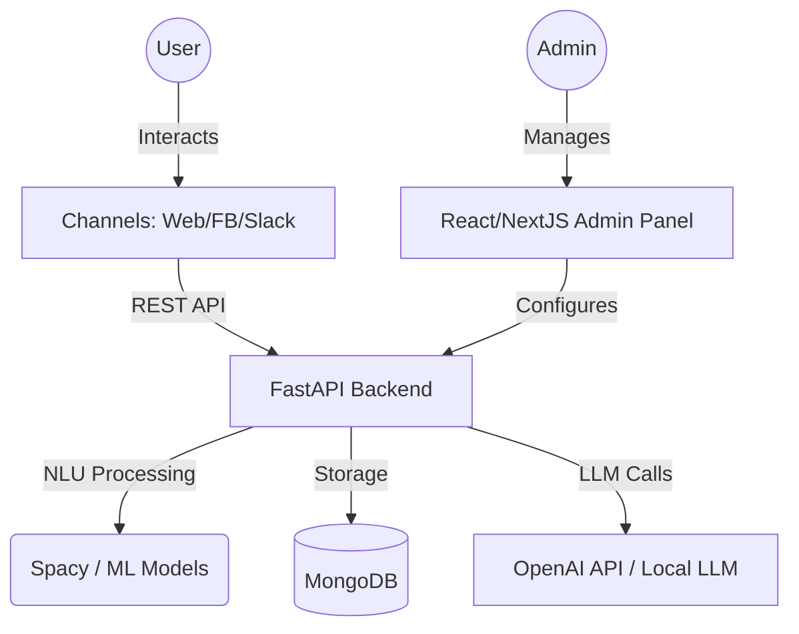

<p align="center">
  
</p>

<p align="center">
  <b>The open-source, self-hosted, DIY Chatbot building platform built in Python.</b>
</p>

<p align="center">
  <a href="https://github.com/abhinavv27/ai-chatbot-usable/actions"></a>
  <a href="https://github.com/abhinavv27/ai-chatbot-usable/actions"></a>
  <a href="License.txt"></a>
</p>

---

## 🚀 Overview

AI Chatbot Framework is a comprehensive platform designed to empower developers and businesses to create, train, and deploy sophisticated AI chatbots with minimal coding effort. 

Unlike black-box commercial solutions, this framework is **fully self-hosted**, giving you 100% ownership of your data and conversational logic. Whether you're building a simple FAQ bot or a complex multi-turn conversational agent, this tool provides the building blocks you need.

## 📸 Preview

### Admin Dashboard & Chat


### Intent & Entity Training
<p align="center">
  
  
</p>

### Bot Testing


## ✨ Key Features

- 🏠 **100% Self-Hosted**: Run it on your own servers or cloud infrastructure.
- 🛠️ **Low-Code Admin Dashboard**: Intuitive UI for building conversational scenarios and training the bot.
- 🧠 **Advanced NLU**: Powered by Spacy and custom ML models for Intent Recognition and Entity Extraction.
- 💬 **Multi-turn Conversations**: Maintain context and handle complex, multi-step user inquiries.
- 🔌 **Tool Calling (API Fulfillment)**: Connect your bot to external APIs to fetch real-time data or trigger actions.
- 💾 **Context Management**: Persistent memory ensures the bot "remembers" user interactions.
- 🌐 **Channel Ready**: Seamlessly integrate with Web (Chat Widgets), Facebook Messenger, and more.
- 🤖 **LLM Integration**: Support for Zero-shot NLU using Large Language Models (LLMs) like OpenAI.

## 🏗️ Architecture

The framework is built with a decoupled architecture to ensure scalability and ease of integration.



## 🛠️ Tech Stack

- **Backend**: Python 3.10+, FastAPI, Pydantic, Motor (Async MongoDB).
- **Frontend**: React, Next.js, Tailwind CSS, TypeScript.
- **Machine Learning**: 
  - **NLU**: Spacy, python-crfsuite.
  - **ML**: Scikit-learn, TensorFlow/Keras.
  - **Orchestration**: LangChain.
- **Database**: MongoDB.
- **Infrastructure**: Docker, Docker Compose, Kubernetes (Helm).

## 🚦 Getting Started

### 📦 Prerequisites

Before you begin, ensure you have the following installed on your system:

#### Essential
- **Git**: [Download Git](https://git-scm.com/downloads) (Required for cloning the repo).
- **Docker & Docker Compose**: [Get Docker Desktop](https://www.docker.com/products/docker-desktop/) (v2.14+ recommended). This is the easiest way to run the full stack.

#### For Manual/Development Mode
- **Python 3.10 or higher**: [Download Python](https://www.python.org/downloads/). Ensure you check "Add Python to PATH" during installation.
- **Node.js 18 or higher**: [Download Node.js](https://nodejs.org/).
- **MongoDB**: [Download Community Edition](https://www.mongodb.com/try/download/community) (If not using Docker).

---

### ⚡ Quick Start (Using Docker)

This method gets everything (Backend, Frontend, MongoDB) up and running in a single command.

#### Using Windows (PowerShell / CMD)
1. **Open PowerShell as Administrator** and navigate to your workspace.
2. **Clone the repository:**
   ```powershell
   git clone https://github.com/abhinavv27/ai-chatbot-usable.git
   cd ai-chatbot-usable
   ```
3. **Fire up the services:**
   ```powershell
   docker-compose up -d
   ```
4. **Access the Admin Panel**: Open `http://localhost:8080` in your browser.

#### Using Git Bash / Linux / macOS
1. **Open your terminal** and run:
   ```bash
   git clone https://github.com/abhinavv27/ai-chatbot-usable.git
   cd ai-chatbot-usable
   docker-compose up -d
   ```
2. **Done!** Access the dashboard at `http://localhost:8080`.

---

### 🛠️ Manual Installation (For Developers)

If you prefer to run the services individually without Docker, follow these steps:

#### 1. Setup Backend (Python)
Open a new terminal (CMD or Git Bash) from the project root:

```bash
cd app
# Create a virtual environment (optional but recommended)
python -m venv venv

# Activate Virtual Env:
# Windows (CMD): venv\Scripts\activate
# Windows (Git Bash/Linux): source venv/bin/activate

# Install dependencies:
pip install -r ../requirements.txt

# Create your .env file:
cp .env.example .env # or create a new file named .env
```

#### 2. Configure API Keys
The framework supports LLM-powered features. To enable them, you must provide an API key. Open the `.env` file in the `app/` folder and edit the following:

| Key | Description | Where to get it |
| --- | --- | --- |
| `OPENAI_API_KEY` | Required for Zero-shot NLU/LLM features | [OpenAI Dashboard](https://platform.openai.com/api-keys) |
| `MONGODB_HOST` | Connection string for MongoDB | Default is `mongodb://localhost:27017` |
| `APPLICATION_ENV` | Run mode | `Development`, `Production`, or `Testing` |

#### 3. Start Backend
```bash
# From app/ directory
python main.py
```
Backend will be available at `http://localhost:8000`.

#### 4. Setup Frontend (React)
Open a **separate** terminal from the project root:

```bash
cd frontend
# Install packages
npm install

# Run the dev server
npm run dev
```
Frontend will be available at `http://localhost:3000`.

---

## 🏗️ Architecture

The framework is built with a decoupled architecture to ensure scalability and ease of integration.


## 🛠️ Tech Stack

- **Backend**: Python 3.10+, FastAPI, Pydantic, Motor (Async MongoDB).
- **Frontend**: React, Next.js, Tailwind CSS, TypeScript.
- **Machine Learning**: 
  - **NLU**: Spacy, python-crfsuite.
  - **ML**: Scikit-learn, TensorFlow/Keras.
  - **Orchestration**: LangChain.
- **Database**: MongoDB.
- **Infrastructure**: Docker, Docker Compose, Kubernetes (Helm).

## 📖 Documentation

Dive deeper into the features and configuration:

- 📥 [Installation Guide](docs/01-installation.md)
- 🏁 [Getting Started](docs/02-getting-started.md)
- 📝 [Creating your first Bot](docs/03-creating-order-status-check.md)
- 🔗 [Channel Integrations](docs/04-integrating-with-channels.md)
- 🏗️ [Full Architecture](docs/05-architecture.md)

## 🤝 Contributing

We welcome contributions from the community! Whether it's fixing bugs, adding features, or improving documentation.

1. Fork the repo.
2. Create your feature branch (`git checkout -b feature/AmazingFeature`).
3. Commit your changes (`git commit -m 'Add some AmazingFeature'`).
4. Push to the branch (`git push origin feature/AmazingFeature`).
5. Open a Pull Request.

Check our [Contributing Guidelines](CONTRIBUTING.md) for more details.

## 📄 License

This project is licensed under the MIT License - see the [License.txt](License.txt) file for details.

---

<p align="center">
  Built with ❤️ for the open-source community.
</p>
